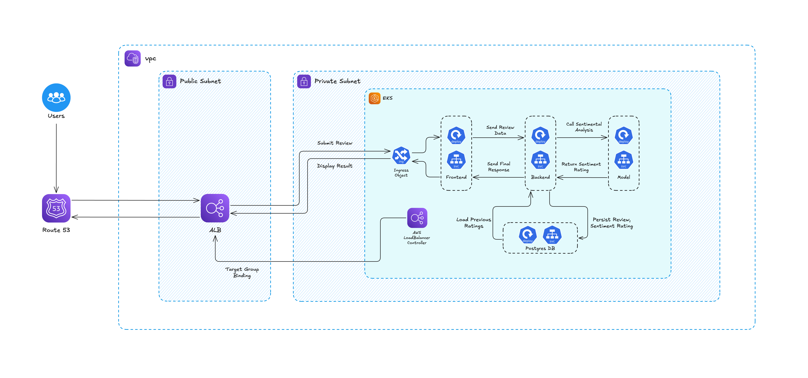

# Movie Analyzer

A comprehensive full-stack movie review application with sentiment analysis capabilities, designed for demonstrating modern DevOps practices, microservices architecture, and Kubernetes/Docker deployment strategies.

## 🎬 Overview

Movie Analyzer is a multi-service application that allows users to browse movies, submit reviews, and automatically analyze sentiment using machine learning. The application showcases modern web development practices with Spring Boot, React, Python Flask, and PostgreSQL, all containerized and ready for Kubernetes/Docker deployment.

### Key Features

- **Movie Reviews**: Browse and submit reviews for 6 popular movies
- **Sentiment Analysis**: Automatic sentiment scoring and rating generation using TextBlob
- **Admin Controls**: Toggle service health, simulate failures, monitor system status
- **Microservices Architecture**: Separate services for frontend, backend, ML model, and database
- **Health Monitoring**: Comprehensive health checks and status monitoring
- **Modern UI**: Responsive React interface with real-time status updates

## 🏗️ Architecture

The application consists of four main services:



### Services

#### 🎨 Frontend (React + Express)
- **Technology**: React 19.1, Express.js, Node.js 24
- **Features**: 
  - Movie grid with 6 popular movies (Shawshank Redemption, Inception, Interstellar, Fight Club, Gladiator, Dark Knight)
  - Movie detail pages with review submission
  - Admin panel for service health monitoring
  - Real-time health checks and status updates
  - Responsive design with modern UI
- **Ports**: 3000 (development), exposed via NodePort 30000 in Kubernetes
- **Health Endpoint**: `/health`

#### ⚙️ Backend (Spring Boot)
- **Technology**: Java 21, Spring Boot 3.5, Maven
- **Features**:
  - RESTful API for review management
  - Database integration with JPA/Hibernate
  - Model server communication for sentiment analysis
  - Admin controls for health simulation
  - Rate limiting and error handling
  - Spring Actuator for monitoring
- **Main Endpoints**:
  - `GET /api/reviews/{movieId}` - Get reviews for a movie
  - `POST /api/reviews` - Submit a new review
  - `GET /api/admin/health` - Health check
  - `POST /api/admin/toggle-health` - Toggle service health
  - `GET /api/admin/status` - Admin status dashboard
- **Health Endpoint**: `/actuator/health`

#### 🤖 Model Server (Python Flask)
- **Technology**: Python 3.12, Flask, TextBlob, NLTK
- **Features**:
  - Sentiment analysis using TextBlob
  - Automatic rating generation (1-5 stars) based on sentiment
  - Admin health toggle for testing
  - Confidence scoring (high/medium/low)
- **Endpoints**:
  - `POST /analyze` - Analyze sentiment of review text
  - `GET /health` - Health check
  - `POST /admin/toggle-health` - Toggle service health
- **Sentiment Categories**: Positive (4-5 stars), Neutral (2.5-3.5 stars), Negative (1-2 stars)

#### 🗄️ Database (PostgreSQL)
- **Technology**: PostgreSQL 15-alpine
- **Features**:
  - Review storage with sentiment data
  - User management (movieuser/moviepass)
  - Sample data included
  - Performance indexes
  - Review statistics view
- **Schema**: `reviews` table with movie_id, review_text, sentiment, rating, timestamps

## 🚀 Getting Started

### Prerequisites

- **Docker & Docker Compose**: For local development
- **Kubernetes**: For production deployment (Minikube, K3s, or full cluster)
- **Helm 3.x**: For Helm-based deployment
- **kubectl**: For Kubernetes management

### Local Development with Docker Compose

The fastest way to run the application locally:

```bash
# Clone the repository
git clone <repository-url>
cd movie-analyzer

# Start all services
docker-compose up -d --build

# View logs
docker-compose logs -f

# Stop services
docker-compose down
```

**Access Points:**
- Frontend: http://localhost:3000

### Docker Compose Configuration

The `docker-compose.yml` provides:

```yaml
services:
  database:    # PostgreSQL 15-alpine
  model:       # Python Flask sentiment analysis
  backend:     # Java Spring Boot API
  frontend:    # React + Express web app
```

**Environment Variables:**
- `DB_HOST=database`, `DB_PORT=5432`, `DB_NAME=moviereviews`
- `DB_USERNAME=movieuser`, `DB_PASSWORD=moviepass`
- `MODEL_SERVER_URL=http://model:5000`
- `BACKEND_API_URL=http://backend:8080`

## ☸️ Kubernetes Deployment

### Option 1: Raw Kubernetes Manifests

Deploy using organized Kubernetes manifests:

```bash
# Navigate to manifests directory
cd deploy/manifests

# Deploy everything
./deploy.sh deploy

# Check deployment status
./deploy.sh status

# View detailed status
kubectl get all -n movie-analyzer

# Access application
# Frontend available at: http://localhost:30000

# Clean up
./deploy.sh cleanup
```

**Manifest Structure:**
```
deploy/manifests/
├── namespace.yaml              # movie-analyzer namespace
├── backend/
│   ├── deployment.yaml         # 1 replica, 512Mi/500m requests
│   ├── service.yaml           # ClusterIP service
│   └── secret.yaml            # Database credentials
├── frontend/
│   ├── deployment.yaml         # 1 replica, 256Mi/250m requests  
│   ├── service.yaml           # NodePort 30000
│   └── ingress.yaml           # Optional ingress
├── model/
│   ├── deployment.yaml         # 1 replica, 256Mi/250m requests
│   └── service.yaml           # ClusterIP service
├── postgres/
│   ├── deployment.yaml         # 1 replica with persistence
│   ├── service.yaml           # ClusterIP service
│   ├── pvc.yaml               # 1Gi persistent volume
│   ├── secret.yaml            # Database secrets
│   └── configmap.yaml         # Initialization scripts
├── deploy.sh                  # Deployment automation
├── kustomization.yaml         # Kustomize configuration
└── README.md                  # Deployment documentation
```

### Option 2: Kustomize Deployment

Alternative deployment using Kubernetes-native Kustomize:

```bash
# Deploy with kustomize
cd deploy/manifests
kubectl apply -k .

# Delete with kustomize  
kubectl delete -k .
```

**Kustomize Features:**
- Single-command deployment
- Common labels and namespace management
- Environment-specific customizations
- Native kubectl integration

### Option 3: Helm Chart Deployment

Deploy using parameterized Helm charts:

```bash
# Install with Helm
cd deploy/helm
helm install movie-analyzer .

# Upgrade deployment
helm upgrade movie-analyzer .

# Customize values
helm install movie-analyzer . \
  --set frontend.replicaCount=1 \
  --set backend.resources.requests.memory=1Gi

# Uninstall
helm uninstall movie-analyzer
```

**Helm Structure:**
```
deploy/helm/
├── Chart.yaml                 # Chart metadata
├── values.yaml               # Default configuration values
├── templates/
│   ├── backend/
│   │   ├── deployment.yaml    # Parameterized backend deployment
│   │   ├── service.yaml       # Backend service template
│   │   └── secret.yaml        # Backend secrets template
│   ├── frontend/
│   │   ├── deployment.yaml    # Frontend deployment template
│   │   ├── service.yaml       # Frontend service template
│   │   └── ingress.yaml       # Optional ingress template
│   ├── model/
│   │   ├── deployment.yaml    # Model service template
│   │   └── service.yaml       # Model service template
│   ├── postgres/
│   │   ├── deployment.yaml    # Database deployment template
│   │   ├── service.yaml       # Database service template
│   │   ├── pvc.yaml           # Persistent volume template
│   │   ├── secret.yaml        # Database secrets template
│   │   └── configmap.yaml     # Database config template
│   └── namespace.yaml         # Namespace template
└── README.md                  # Helm-specific documentation
```

## 🔧 Admin Features

### Service Health Monitoring

The application includes comprehensive admin controls for testing resilience:

#### Health Toggle Endpoints
- **Backend Health**: `POST /api/admin/toggle-health`
- **Model Health**: `POST /admin/toggle-health` (model service)
- **Database Simulation**: `POST /api/admin/toggle-database`
- **Model Connection Simulation**: `POST /api/admin/toggle-model`

#### Admin Panel Features
Access via the floating admin panel in the frontend:

1. **Service Status Monitoring**: Real-time health checks every 10 seconds
2. **Health Toggle Controls**: Simulate service failures
3. **System Information**: Memory usage, uptime, processor count
4. **Error Simulation**: Test failure scenarios and recovery

### Testing Scenarios

1. **Backend Failure**: Toggle backend health to test frontend error handling
2. **Database Connectivity**: Simulate database connection issues
3. **Model Server Failure**: Test sentiment analysis service failures
4. **Overload Simulation**: Test backend overload scenarios

## 📊 API Documentation

### Review Endpoints

#### Get Reviews for Movie
```http
GET /api/reviews/{movieId}
```
**Response**: Array of review objects with sentiment analysis

#### Submit Review
```http
POST /api/reviews
Content-Type: application/json

{
  "movieId": "shawshank",
  "reviewText": "Amazing movie with great story!"
}
```
**Response**: Review object with sentiment analysis and rating

#### Get Review Statistics
```http
GET /api/reviews/stats
```
**Response**: Overall review statistics

#### Get Latest Reviews
```http
GET /api/reviews/latest
```
**Response**: Recent reviews across all movies

### Admin Endpoints

#### Health Check
```http
GET /api/admin/health
```
**Response**: Service health status

#### System Information
```http
GET /api/admin/info
```
**Response**: Memory usage, uptime, system information

#### Toggle Service Health
```http
POST /api/admin/toggle-health
POST /api/admin/toggle-database
POST /api/admin/toggle-model
```
**Response**: Updated service status

### Model Service Endpoints

#### Sentiment Analysis
```http
POST /analyze
Content-Type: application/json

{
  "text": "This movie was absolutely fantastic!"
}
```
**Response**:
```json
{
  "sentiment": "positive",
  "score": 0.95,
  "confidence": "high",
  "rating": 4.8,
  "timestamp": 1640995200.0
}
```

## 🛠️ Development

### Building Images

```bash
# Build all images
docker-compose build

# Build individual services
docker build -t movie-backend ./backend
docker build -t movie-frontend ./frontend  
docker build -t movie-model ./model
```

### Environment Variables

#### Backend
- `DB_HOST`: Database hostname (default: database)
- `DB_PORT`: Database port (default: 5432)
- `DB_NAME`: Database name (default: moviereviews)
- `DB_USERNAME`: Database user (default: movieuser)
- `DB_PASSWORD`: Database password (default: moviepass)
- `MODEL_SERVER_URL`: Model service URL (default: http://model:5000)
- `SERVER_PORT`: Backend port (default: 8080)

#### Frontend
- `BACKEND_API_URL`: Backend API URL (default: http://backend:8080)

#### Model
- `MODEL_PORT`: Model service port (default: 5000)

#### Database
- `POSTGRES_DB`: Database name (default: moviereviews)
- `POSTGRES_USER`: Database user (default: postgres)
- `POSTGRES_PASSWORD`: Database password (default: postgres)

### Database Schema

```sql
CREATE TABLE reviews (
    id BIGSERIAL PRIMARY KEY,
    movie_id VARCHAR(255) NOT NULL,
    review_text VARCHAR(2000) NOT NULL,
    sentiment VARCHAR(50),
    sentiment_score DOUBLE PRECISION,
    rating DOUBLE PRECISION,
    created_at TIMESTAMP DEFAULT CURRENT_TIMESTAMP
);

-- Indexes for performance
CREATE INDEX idx_reviews_movie_id ON reviews(movie_id);
CREATE INDEX idx_reviews_created_at ON reviews(created_at);
CREATE INDEX idx_reviews_sentiment ON reviews(sentiment);
```

### Sample Data

The database includes sample reviews for all 6 movies:
- **The Shawshank Redemption** (shawshank)
- **Inception** (inception)  
- **Interstellar** (interstellar)
- **Fight Club** (fight-club)
- **Gladiator** (gladiator)
- **The Dark Knight** (dark-knight)

## 🚦 Monitoring & Health Checks

### Kubernetes Health Checks

#### Readiness Probes
- **Backend**: `/actuator/health` (10s interval)
- **Frontend**: `/health` (5s interval)
- **Model**: `/health` (5s interval)

#### Liveness Probes
- **Backend**: `/actuator/health` (10s interval)
- **Frontend**: `/health` (10s interval)  
- **Model**: `/health` (10s interval)

## 📁 Project Structure

```
movie-analyzer/
├── backend/                   # Spring Boot backend service
│   ├── src/main/java/com/moviereview/
│   │   ├── controller/        # REST controllers
│   │   ├── service/          # Business logic
│   │   ├── repository/       # Data access layer
│   │   ├── entity/           # JPA entities
│   │   └── config/           # Configuration classes
│   ├── Dockerfile
│   └── pom.xml               # Maven dependencies
├── frontend/                  # React frontend service
│   ├── src/
│   │   ├── components/       # React components
│   │   ├── data/            # Static data (movies)
│   │   ├── App.js           # Main React application
│   │   └── index.js         # React entry point
│   ├── public/              # Static assets
│   ├── server.js            # Express server
│   ├── Dockerfile
│   └── package.json         # Node.js dependencies
├── model/                     # Python Flask model service
│   ├── app.py               # Flask application
│   ├── requirements.txt     # Python dependencies
│   ├── Dockerfile
│   └── README.md
├── database/                  # Database initialization
│   └── init.sql             # Database schema and sample data
├── deploy/                    # Deployment configurations
│   ├── manifests/           # Kubernetes manifests
│   │   ├── backend/
│   │   ├── frontend/
│   │   ├── model/
│   │   ├── postgres/
│   │   ├── deploy.sh        # Deployment script
│   │   ├── kustomization.yaml
│   │   └── README.md
│   └── helm/                # Helm chart
│       ├── templates/
│       ├── Chart.yaml
│       ├── values.yaml
│       └── README.md
├── docker-compose.yml         # Local development setup
├── .gitignore
└── README.md                 # This file
```

---

**Movie Analyzer** - Demonstrating modern DevOps practices with microservices, containers, and Kubernetes orchestration. 